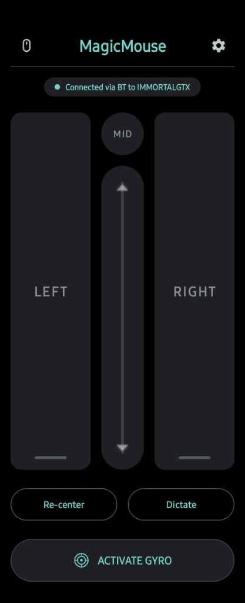

# MagicMouse

An Android air mouse for Windows that actually feels natural to use.

<p align="center">
  
</p>

Most smartphone mouse apps get frustrating quickly. They rely on basic gyroscope data, which causes the cursor to drift across your screen within seconds. MagicMouse fixes this by combining 9-axis sensor fusion (gyroscope, accelerometer, and magnetometer) on your phone with a C++ 1 Euro Filter on your PC, keeping cursor movement steady and accurate.

---

## Why Dual Connection Modes? (Bluetooth + Wi-Fi)

When you first open the app, you can choose how your phone connects to your PC:

1. **Bluetooth RFCOMM (Recommended)**:
   - **Why we added this**: Standard Wi-Fi networks in homes and offices often suffer from network congestion, router bufferbloat, and random latency spikes. When streaming high-frequency 240Hz sensor packets over Wi-Fi, these hiccups make cursor movement feel jumpy or delayed. Bluetooth RFCOMM provides a direct point-to-point wireless link that avoids Wi-Fi network traffic completely, delivering consistent, low-latency tracking.
2. **Wi-Fi UDP**:
   - Ideal when your PC does not have built-in Bluetooth hardware or when you want to control your PC from another room on the same local network.

---

## Technical Highlights

- **Absolute Pointer Mapping**: Maps phone orientation directly to screen position. Pointing at the screen center targets the center of your monitor with zero position drift.
- **Dynamic High Refresh Rate (240Hz)**: The C++ server automatically detects your monitor's refresh rate (`EnumDisplaySettings`) and adjusts filter parameters on-the-fly for high-refresh displays.
- **Instant Server-Synchronized Re-center**: Tapping "Re-center" resets orientation baselines on both the phone and the server simultaneously, bringing your cursor right back to the center of your screen.
- **Compact Telemetry Protocol**: Streams 17-byte binary packets for minimal overhead over both Bluetooth and Wi-Fi.
- **Full Media & Accessibility Controls**: Left, right, and middle clicks, double-tap, vertical scroll strip, physical volume button control, keyboard shortcuts, and voice dictation.

---

## Quick Setup Guide

### 1. Start the Windows Server
Build and launch the background server using `g++` (via MinGW / MSYS2):

```cmd
cd server
g++ src/main.cpp src/InputController.cpp -o MagicMouseServer.exe -lws2_32 -luser32
./MagicMouseServer.exe
```

The server automatically listens on both Bluetooth RFCOMM and Wi-Fi UDP (port 9876).

### 2. Install the Android App
Build the APK using Gradle:

```cmd
cd android_app
./gradlew assembleDebug
```

Install the APK on your phone, open **MagicMouse**, select **Bluetooth** or **Wi-Fi (UDP)**, and tap **Connect**!
